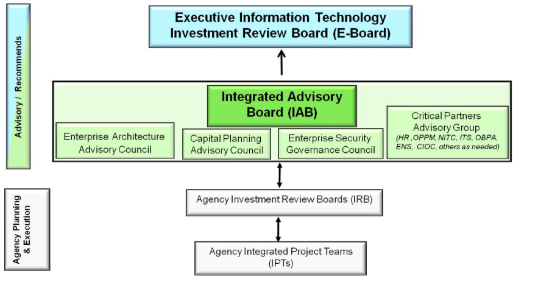

## **Integrated Governance Lifecycle Management**

The Secretary and Deputy Secretary of Agriculture provide USDA’s overall guidance and direction, with the Under Secretaries and Assistant Secretaries providing leadership in the seven Mission Areas and staff offices. The Chief Information Officer (CIO) has primary responsibility for overseeing and coordinating the design, acquisition, maintenance, use, and disposal of IT goods and services.

Through the implementation of an enterprise-wide IT governance process, the CIO brings together USDA Agencies, Staff Offices, and internal IT resources to promote department-wide technology innovations and operations that provide high-value return on investment. (Refer to Appendix D in the USDA IT Strategic Plan, titled “Governance Process”).
